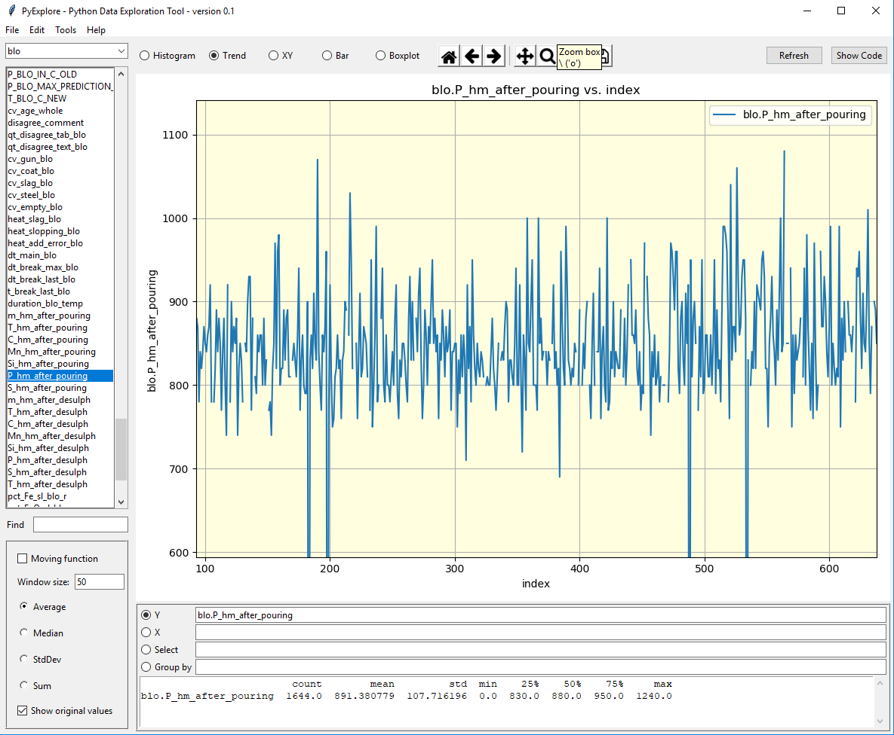
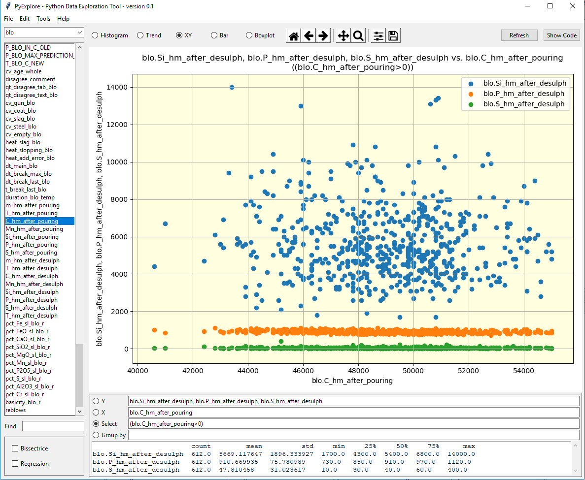
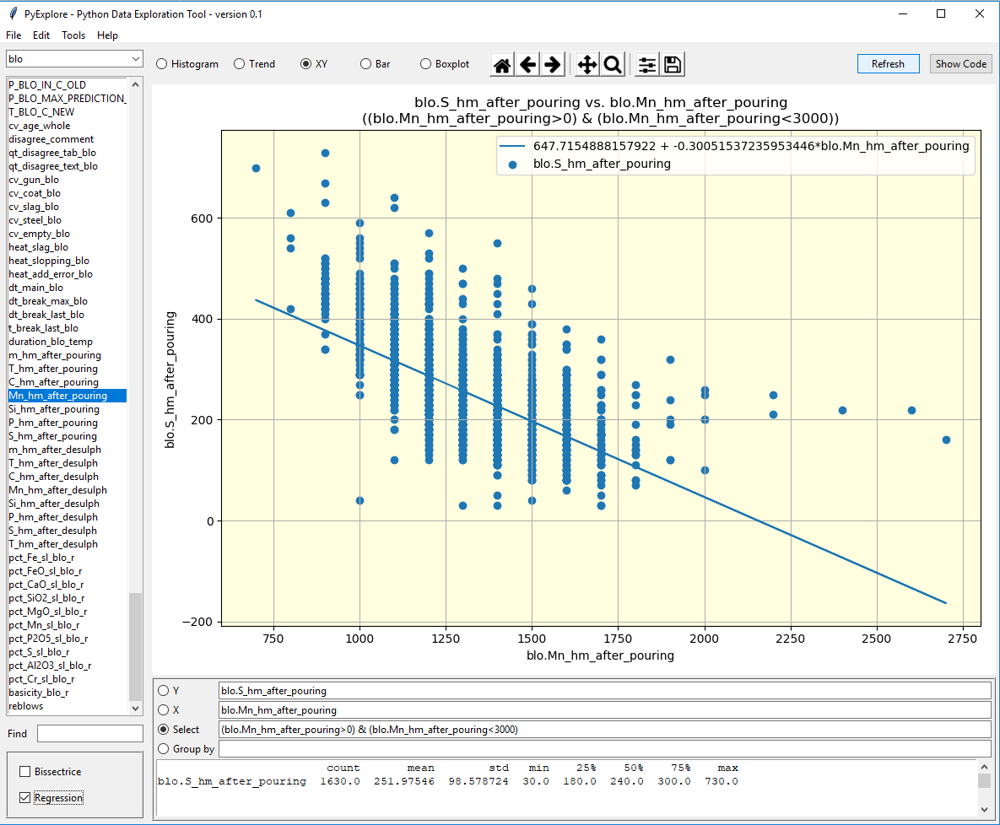
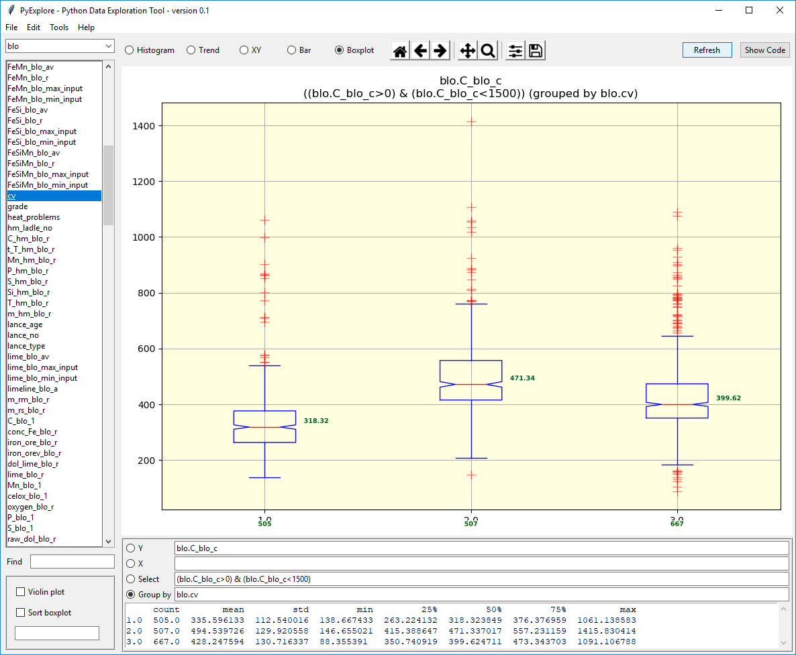
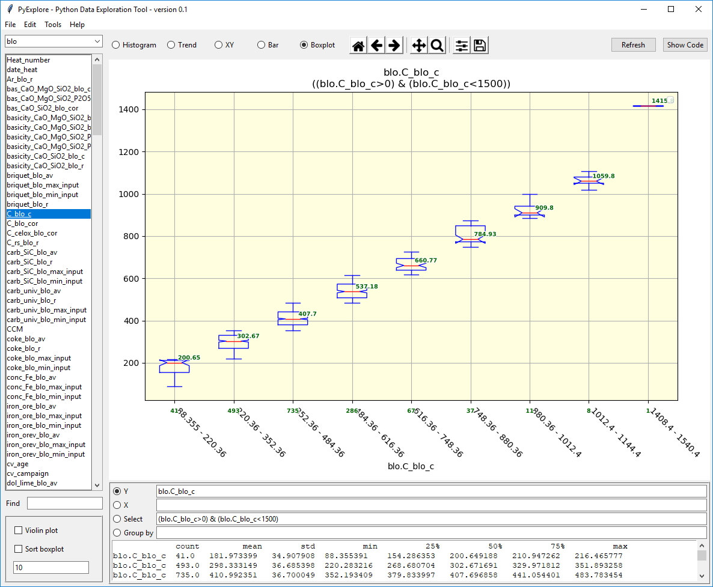

# PyDex
Data analysis tool developed in ArcelorMittal Poland

This tool is created to support process engineers in data analysis.
Graphical user interface prepared with tkinter.
Created, developped and tested in new version of Anaconda environment, also used on Jupyter.

Supports Dataframe format data, also can load files in xlsx, pkl, csv formats.
Results can be exported as png graphs.
Statistical tests performed online on data.

The tool still under development, actively applied in practice.

# PyDex - Graphical User Interface

# Importing data from files

# Example: histogram

# Example: multiple variables

# Example: trend plot

# Example: XY scatter plot with filtering

# Data filtering and linear regression

# Example: Boxplot with grouping"

# Example: Boxplot with automatic/custom binning

