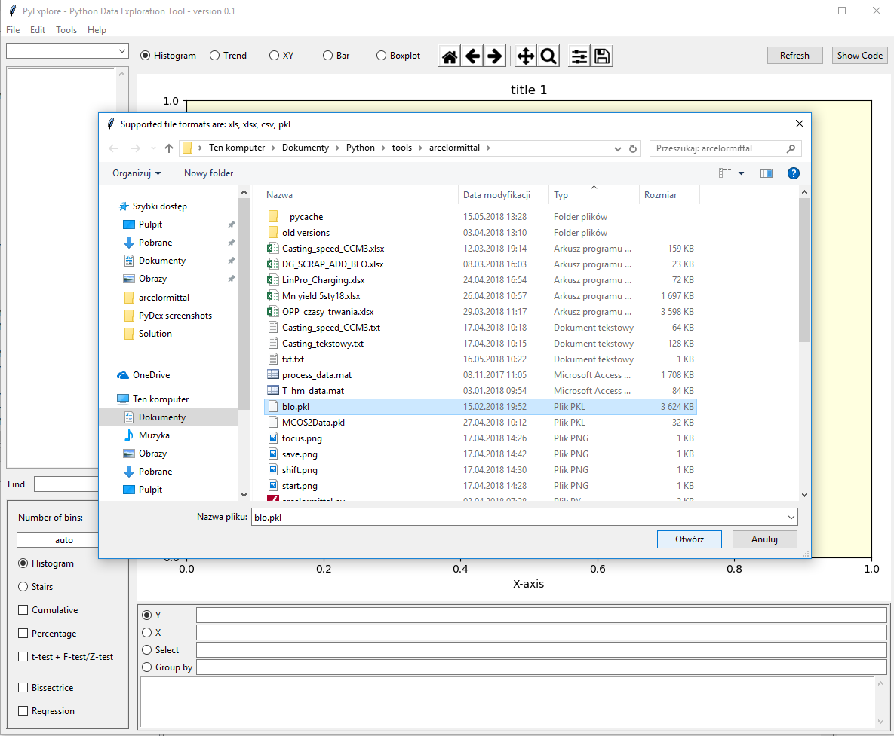
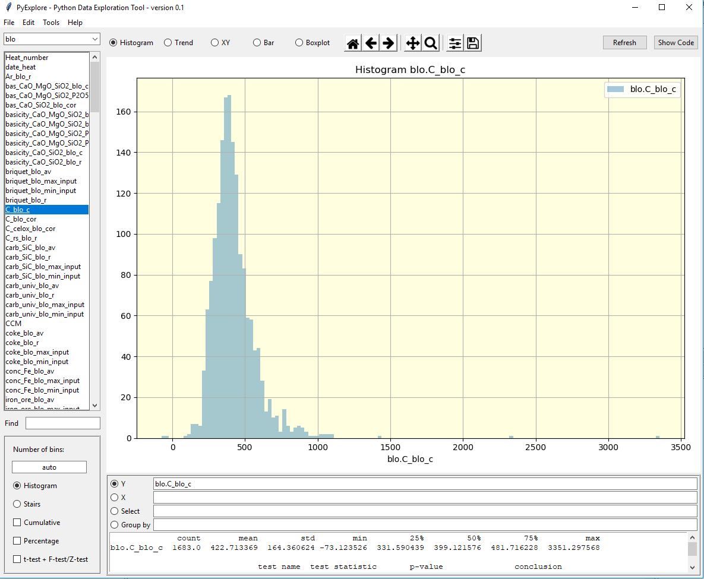
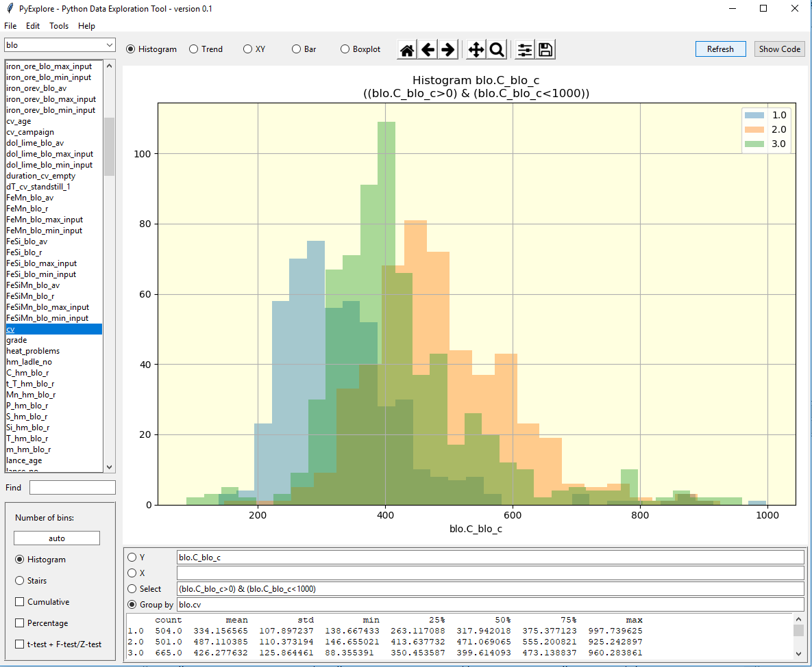

# pydex
Data analysis tool developed in ArcelorMittal Poland

This tool is created to support process engineers in data analysis.
Graphical user interface prepared with tkinter.
Created, developped and tested in new version of Anaconda environment, also used on Jupyter.

Supports Dataframe format data, also can load files in xlsx, pkl, csv formats.
Results can be exported as png graphs.
Statistical tests performed online on data.

The tool is still under development, but actively applied in practice.

